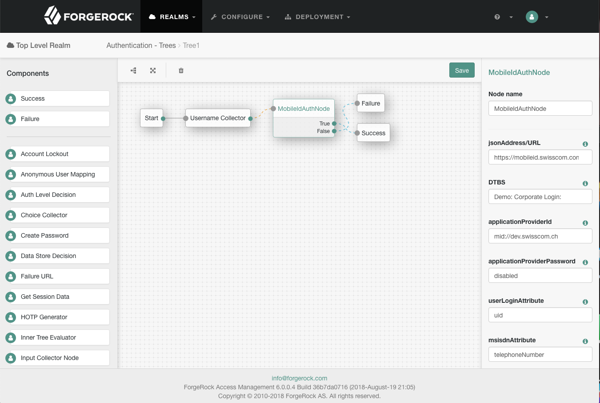

<!--
 * The contents of this file are subject to the terms of the Common Development and
 * Distribution License (the License). You may not use this file except in compliance with the
 * License.
 *
 * You can obtain a copy of the License at legal/CDDLv1.0.txt. See the License for the
 * specific language governing permission and limitations under the License.
 *
 * When distributing Covered Software, include this CDDL Header Notice in each file and include
 * the License file at legal/CDDLv1.0.txt. If applicable, add the following below the CDDL
 * Header, with the fields enclosed by brackets [] replaced by your own identifying
 * information: "Portions copyright [year] [name of copyright owner]".
 *
 * Copyright ${data.get('yyyy')} ForgeRock AS.
-->
# MobileIdAuthNode

An [swisscom mobile-connect](https://www.swisscom.ch/de/business/mobile-id/overview.html) authentication node for ForgeRock's [Identity Platform][forgerock_platform] 6.0 and above.

This node takes an Username as input (eg via [Input Collector Node](https://github.com/ForgeRock/input-collector-auth-tree-node) and maps it to the user's login attribute (eg. uid) in the IdRepo. It expects the MSISDN of the user stored in the user's profile.

Copy the .jar file from the ../target directory into the ../web-container/webapps/openam/WEB-INF/lib directory where AM is deployed. Restart the web container to pick up the new node. The node will then appear in the authentication trees components palette.

**USAGE HERE**

* __jsonAddress__. jsonAddress/URL of MSS; sample value "https://mobileid.swisscom.com/rest/service"
* __dtbs__. Message that gets displayed on the user's handset; sample value "Demo: Corporate Login:"; (will be extended with an unique string).
* __applicationProviderId__. Application Provider ID as provided by MSS; sample Value "mid://dev.swisscom.ch"
* __applicationProviderPassword__. Application Provider's Password as provided by MSS
* __userLoginAttribute__. IdRepo Attribute to identify the users' profile; sample value "uid"
* __msisdnAttribute__. LDAP attribute in IdRepo that stores user's msisdn; sample value telefoneNumber (spaces will be stripped off)
* __languageAttribute__. LDAP attribute in IdRepo that stores user's preferred language; sample value "en"; not existent or not supported value will cause fallback to "en"; supported values are "en","de","fr" and "it"
* __trustStoreFile__. Path to java keystore file (in pkcs12 format) that contains MSS CA certifiactes; sample value "/usr/local/forgerock/openam/openam/my-truststore.p12"
* __trustStorePassword__. Password for that java keystore file
* __caSslAlias__. Alias of MSS CA certifiacte in the truststore presented during establishing the TLS connection; sample value "mobileid-ca-ssl"
* __caSignAlias__. Alias of MSS CA certificate in the truststore used to sign the signature response; sample value "mobileid-ca-sign"
* __keyStoreFile__. Path to java keystore file (in pkcs12 format) that contains the private key used while establishing the TLS channel; sample value "/usr/local/forgerock/openam/openam/my-keystore.p12"
* __keyStorePassword__. Password for that keystore
* __privateKeyAlias__. Alias of private key in java keystore; sample value "mobile.forgerock.ch"
* __timeOut__. Time (in seconds) MSS waits for user's response; sample value "80"
* __connectionTimeout__. Time (in seconds) to wait for MSS response; sample value "90"

The code in this repository has binary dependencies that live in the ForgeRock maven repository. Maven can be configured to authenticate to this repository by following the following [ForgeRock Knowledge Base Article](https://backstage.forgerock.com/knowledge/kb/article/a74096897).

A sampe tree that makes use of this node could look like:

This tree just gatheres the user's userId and start the MobileConnnect flowd.

The sample code described herein is provided on an "as is" basis, without warranty of any kind, to the fullest extent permitted by law. ForgeRock does not warrant or guarantee the individual success developers may have in implementing the sample code on their development platforms or in production configurations.

ForgeRock does not warrant, guarantee or make any representations regarding the use, results of use, accuracy, timeliness or completeness of any data or information relating to the sample code. ForgeRock disclaims all warranties, expressed or implied, and in particular, disclaims all warranties of merchantability, and warranties related to the code, or any service or software related thereto.

ForgeRock shall not be liable for any direct, indirect or consequential damages or costs of any type arising out of any action taken by you or others related to the sample code.

[forgerock_platform]: https://www.forgerock.com/platform/  
